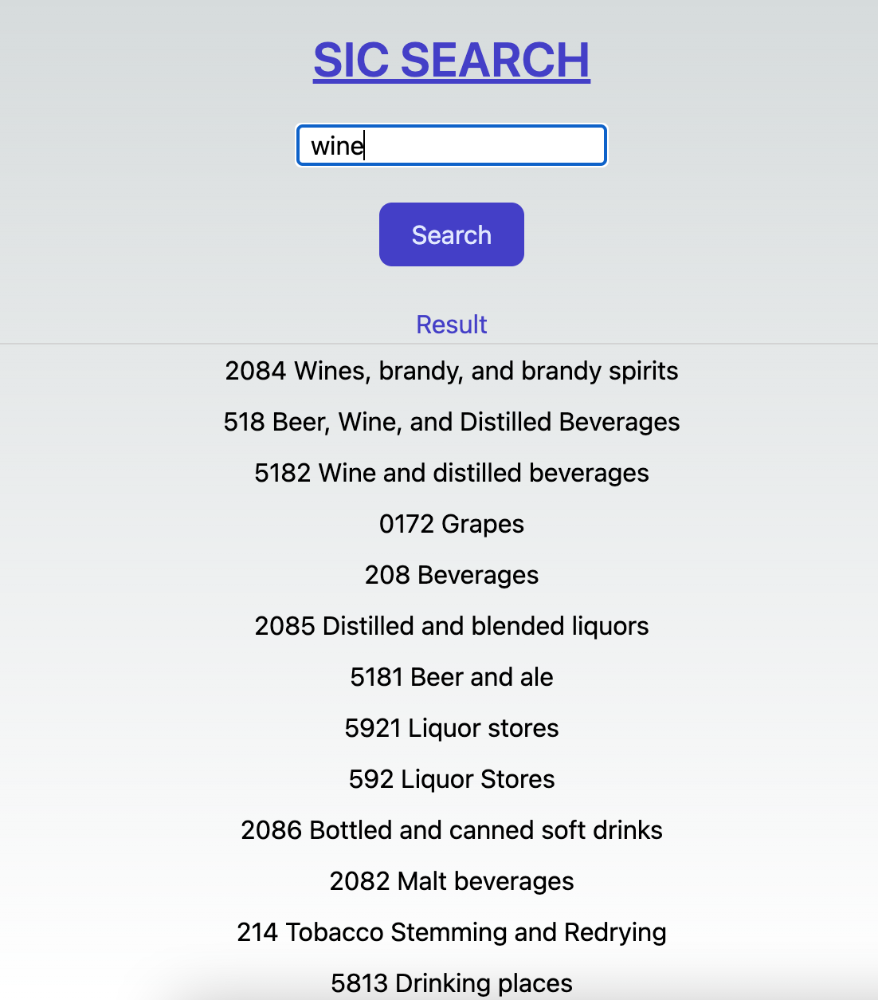

# Demo App to Perform Semantic Search
This demo app can be used to perform semantic search for [Standard Industrial Classification (SIC)](https://www.osha.gov/data/sic-manual) database.  The CSV file used for this demo is downloaded from [here](https://www.bls.gov/cew/classifications/industry/sic-industry-titles.htm). We will be using PineCone as vector database for storing and searching feature and OpenAI LLM to create embeddings.

Below diagram shows data load process implemented fo this demo app: 


Architecture for the search process is illustrated below: 


Our front end code is quite simple. It simply allows user to enter search text. The code then sends the text to the service for semantci query. Relevant code is shown below:  
```
    const onSubmit = async (e: React.FormEvent<HTMLFormElement>) => {
    e.preventDefault()
    if (!query) return
    setIsLoading(true);
    setResult([]);
    try {
      const data = {question:query};
      const res = await fetch(serviceUrl, {
        method: 'POST',
        body: JSON.stringify(data)
      })
      // handle the error
      if (!res.ok) throw new Error(await res.text())
      setIsLoading(false);
      const resJ = await res.json();
      setResult(resJ.matches);
    } catch (e: any) {
      // Handle errors here
      console.error(e)
      setIsLoading(false);
    }
  }
```


Next lets discuss the backend. The backend code creates vector embedding for input text using OpenAI. The embedding vector is passed to Pinecone database to perform semantically matching terms which is relayed back to the client. Relevant code is given below:


```
 const pinecone = new Pinecone();

      // Target the index
      const indexName = getEnv("PINECONE_INDEX");
      const index = pinecone.index(indexName);

      const openai = new OpenAI({
        apiKey: getEnv("OPENAI_KEY"),
        });
        
        const embedding = await openai.embeddings.create({
            model: "text-embedding-ada-002",
            input:body.question,
            encoding_format: "float",
        });
        

      const topK: number = 15;
      // Query the index using the query embedding
      const results = await index.query({
        vector: embedding.data[0].embedding,
        topK,
        includeMetadata: true,
        includeValues: false,
      });

        results.matches?.map((match) => ({
          text: match.metadata?.text,
          score: match.score,
        }))
      
      
       return {
          statusCode: 200,
          body: JSON.stringify(results),
      };

```

JSON input payload to the service is given below:
```
{"question":"wine"}
```
Response includes matching terms based on the descending score of cosine similarity with the input text. In the response, we also include the SIC title text loaded as a metadata field in the vector database.
```
{
  "matches": [
    {
      "id": "264",
      "score": 0.853567243,
      "values": [],
      "metadata": {
        "text": "2084 Wines, brandy, and brandy spirits"
      }
    },
    {
      "id": "1133",
      "score": 0.844626307,
      "values": [],
      "metadata": {
        "text": "518 Beer, Wine, and Distilled Beverages"
      }
    },
    {
      "id": "1135",
      "score": 0.842519879,
      "values": [],
      "metadata": {
        "text": "5182 Wine and distilled beverages"
      }
    },
    {
      "id": "17",
      "score": 0.829657078,
      "values": [],
      "metadata": {
        "text": "0172 Grapes"
      }
    }
  ]
}

Please see [https://kafles.com/2024/04/29/practical-llm4/](https://kafles.com/2024/04/29/practical-llm4/) for more details.

Screenshot of the demo app:




Happy Searching!!!
